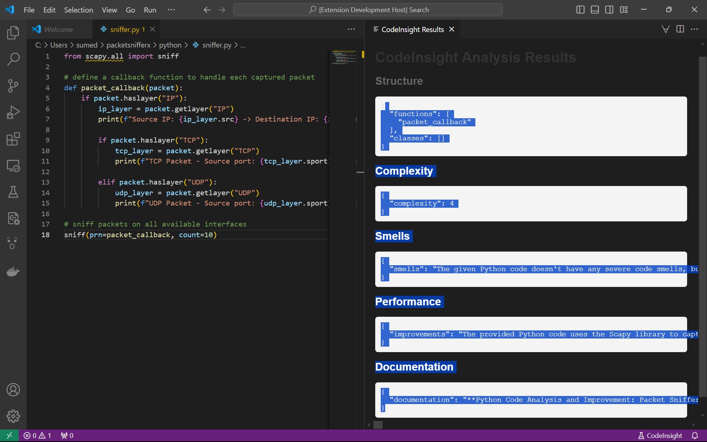

# CodeInsight: Advanced Code Analysis VSCode Extension

## Overview

CodeInsight is a handy VSCode extension designed to give developers deeper insights into their Python and JavaScript code. It breaks down your code’s structure, highlights complexity levels, flags potential code smells, and even suggests ways to boost performance. With built-in documentation generation, CodeInsight also helps you create README files. It uses GROQ's API to generate suggestions.



## Features

- **Code Structure Analysis**: Visualize functions and classes in your Python and JavaScript files.
- **Complexity Calculation**: Get a quantitative measure of your code's complexity.
- **Code Smell Detection**: Identify potential issues and receive refactoring suggestions.
- **Performance Improvement**: Receive AI-powered suggestions to optimize your code.
- **Documentation Generation**: Automatically generate comprehensive documentation for your code.

## Installation

1. Open Visual Studio Code
2. Go to the Extensions view (Ctrl+Shift+X)
3. Search for "CodeInsight"
4. Click Install

## Setup

1. Clone the repository:
   ```
   git clone https://github.com/yourusername/codeinsight-vscode.git
   ```

2. Navigate to the project directory:
   ```
   cd codeinsight-vscode
   ```

3. Install dependencies:
   ```
   npm install
   ```

4. Set up your Groq API key:
   - Create a `.env` file in the root directory
   - Add your Groq API key: `GROQ_API_KEY=your_api_key_here`

5. Open the project in VSCode:
   ```
   code .
   ```

6. Press F5 to run the extension in a new Extension Development Host window.

## Usage

1. Open a Python or JavaScript file in VSCode.
2. Right-click in the editor and select "CodeInsight: Analyze File" from the context menu.
3. Choose the type of analysis you want to perform.
4. View the results in the CodeInsight output panel.

## Configuration

You can customize CodeInsight's behavior in your VSCode settings:

```json
{
  "codeinsight.enabledLanguages": ["python", "javascript"],
  "codeinsight.maxComplexityWarning": 10,
  "codeinsight.autoAnalyzeOnSave": true
}
```

## Contributing

Contributions are welcome! Please feel free to submit a Pull Request.
